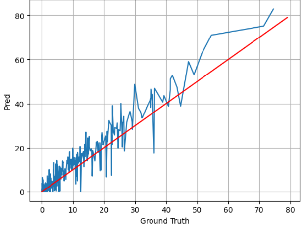

# Swin-Unet

This model achieves the following performance on the brain hemorrhage segmentation

**Cerebral Hemorrhage Segmentation Analysis for Cerebral Hemorrhage Bleeding Volume Estimation on Brain CT Imaging: A Pilot Study, Eunseo Jun et all., KCC 2024**

- Compare performance based on lesion size

|  | Dice | MIoU | MPA |
| --- | --- | --- | --- |
| Top 10% | 0.8581 | 0.7648 | 0.8548 |
| Top 30% | 0.7893 | 0.6803 | 0.7752 |
| All | 0.5373 | 0.4349 | 0.5377 |


You can calculate the brain hemorrhage volume in calculate_volume.ipynb🧠

 

# How to train?

Added a validation loader that wasn't in the original code ! :sparkles: 

## Data prepare

Your train data should be converted to an npz file and inserted into datasets/Synapse.

Since the test is per patient, we use the H5 compressed format.

Insert your data list text file in Swin-Unet-main/lists/lists_Synapse

→If you want to convert your data and create a text file, see '[here](https://github.com/EunseoJun/Medical-Image-pre-processing)'←'EunseoJun/medical_image_preprocessing' supports data list text file conversion, npz conversion.

## Train

```jsx
python [train.py](http://train.py/) --dataset Synapse --cfg configs/swin_tiny_patch4_window7_224_lite.yaml --root_path datasets/Synapse --max_epochs 150 --output_dir YOUR_PATH  --img_size 224 --base_lr 0.05 --batch_size 24 --num_classes 1 --n_gpu 2
```

## Test

```jsx
python [test.py](http://test.py/) --dataset Synapse --cfg configs/swin_tiny_patch4_window7_224_lite.yaml --is_saveni --volume_path '/home/users/aiml_jes/Swin-Unet-main/datasets/Synapse' --output_dir YOUR_PATH --max_epoch 1 --base_lr 0.05 --img_size 224 --batch_size 24 --num_classes 1
```