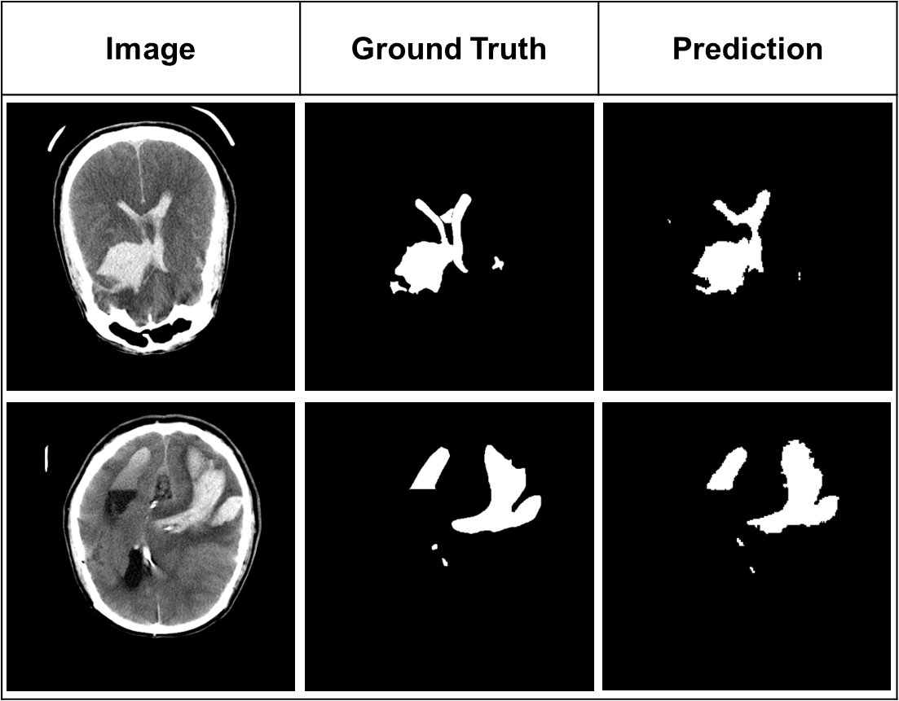

# Swin-Unet

This model achieves the following performance on the brain hemorrhage segmentation

**Cerebral Hemorrhage Segmentation Analysis for Cerebral Hemorrhage Bleeding Volume Estimation on Brain CT Imaging: A Pilot Study, Eunseo Jun et all., KCC 2024**

- Compare performance based on lesion size

|  | Dice | MIoU | MPA |
| --- | --- | --- | --- |
| Top 10% | 0.8581 | 0.7648 | 0.8548 |
| Top 30% | 0.7893 | 0.6803 | 0.7752 |
| All | 0.5373 | 0.4349 | 0.5377 |

<<<<<<< HEAD

**Pilot study: Semantic segmentation deep-learning based cervical feature extraction for predicting preterm birth in transvaginal ultrasound, Minseo Hwangbo et al,. KCC 2024**

Swin-Unet achieves best score :sparkles: 

| Model | MIoU | Dice | MPA | HD |
| --- | --- | --- | --- | --- |
| SegNet | 0.5822 | 0.7128 | 0.9861 | 5.9655 |
| U-Net | 0.6086 | 0.7386 | 0.9876 | 5.8431 |
| Swin-Unet | 0.6201 | 0.7507 | 0.9875 | 5.7755 |

=======

>>>>>>> abafc6d7e6a0b46cd8eb566f6d217f34c74e6738
